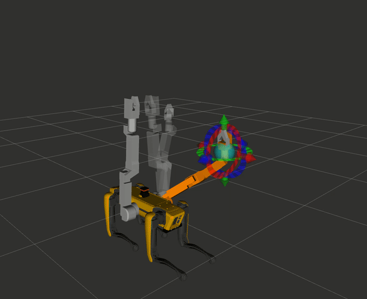
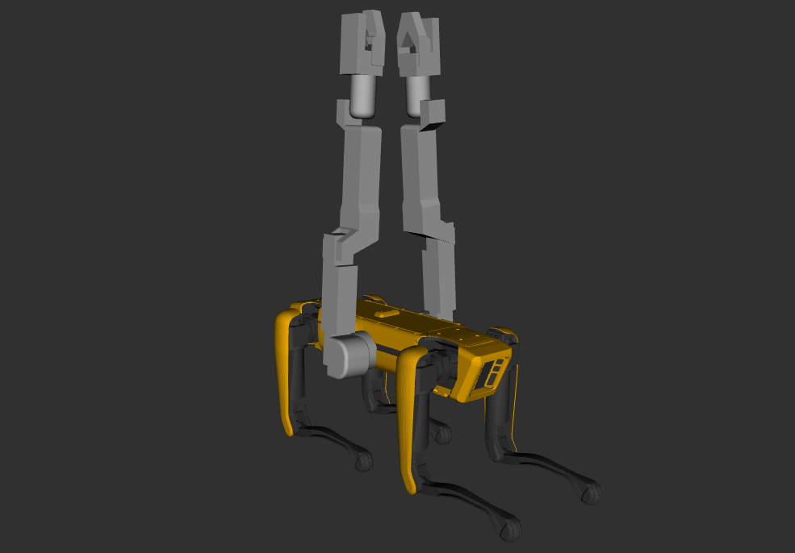

# Spot With Dual Arms

#### The following repository provides a URDF file for the Boston Dynamics Spot Quadruped with Dual 6-axis Arms.

   

### ROS Packages:
* **spot_description:** contains the Spot URDF with two arms.
* **spot_arm_moveit:** contains the Moveit package, which allows us to control both arms individually.

### The Benefits of the design:
* The ability for the quadruped to function as a 6-legged robot in rough terrain
* The ability to carry large objects (considering that the robot's top is unobstructed) and use the two arms to hold the object.
* The ability to quickly recover after an unexpected robot fall.

   

